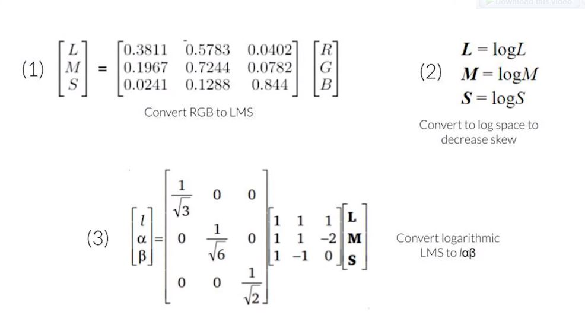
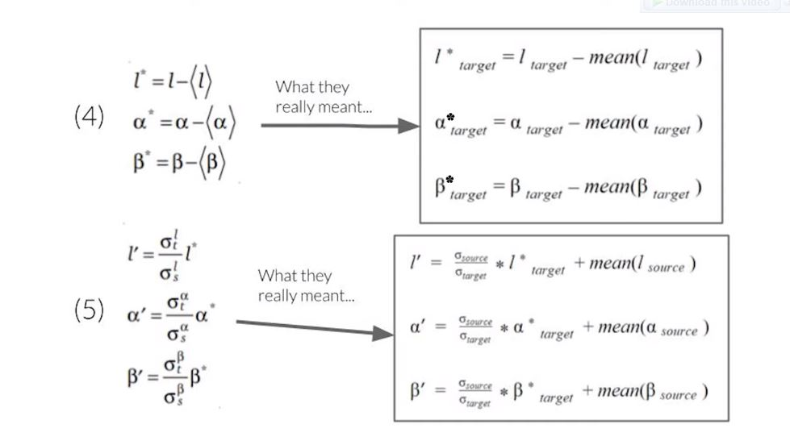

# Color Transfer Between Images

Color transfer is a practical method to change the appearance of a source image according to the color patternof a target image.

Based on the implementation of the paper of [Color Transfer Between Images](https://www.cs.tau.ac.il/~turkel/imagepapers/ColorTransfer.pdf) by Erik Reinhard, Michael Ashikhmin, Bruce Gooch and Peter Shirley.

# Features

- Read BMP file (source/target image)
- Calculate the mean and STD of each channel
- Implement the RGB color transfer algorithm
  - Convert images from RGB to ℓαβ color space
  - Statistics and color correction
  - 
    
    
    

# Results

# References

- [Color Transfer Between Images](https://www.cs.tau.ac.il/~turkel/imagepapers/ColorTransfer.pdf)

* [Reinhard color transfer](https://www.youtube.com/watch?v=-IaBjbRuqpI&list=PLyhJeMedQd9QrXtCspclJ9ace2urp05o0&index=19&ab_channel=Ahmedibrahim)
